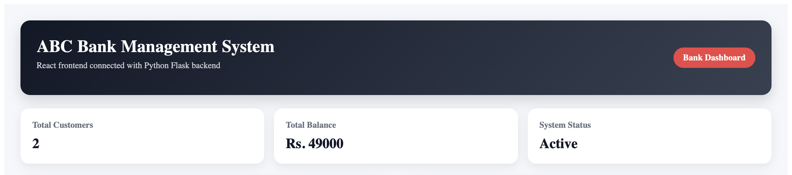
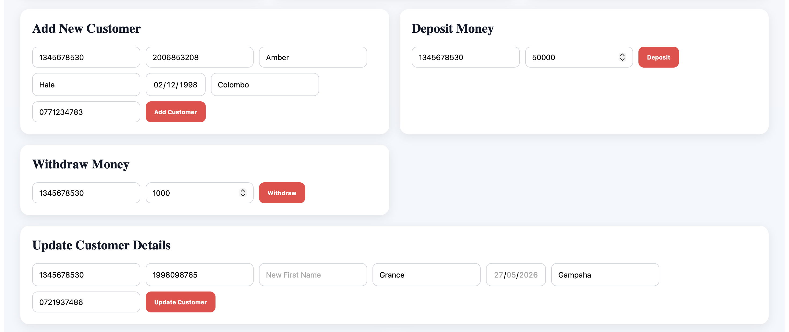
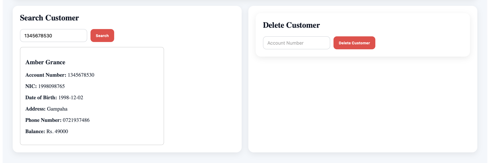
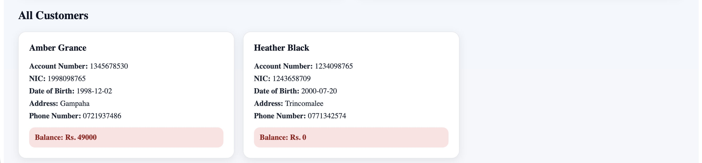

# ABC Bank Management System

ABC Bank Management System is a full-stack banking management application developed using React for the frontend and Python Flask for the backend. The system allows users to manage customer accounts through a clean dashboard interface while keeping the main banking logic in Python.

## Project Description

This project was first developed as a console-based Python banking system. It was later improved by creating a React user interface and connecting it to the existing Python logic using Flask API routes.

The system supports adding customers, viewing customer details, depositing money, withdrawing money, updating customer information, searching for customers by account number, and deleting customer records. Customer data is saved using a JSON file so that records are not lost after restarting the backend server.

## Features

- Add new customer accounts
- View all customer details
- Search customer by account number
- Deposit money to an account
- Withdraw money from an account
- Update customer information
- Delete customer records
- Display total number of customers
- Display total account balance
- Store customer data using a JSON file
- Responsive dashboard-style React interface

## Technologies Used

### Frontend

- React
- Vite
- JavaScript
- CSS

### Backend

- Python
- Flask
- Flask-CORS
- JSON file storage

## Screenshots

### Dashboard Overview

The dashboard displays the main system title, total number of customers, total account balance, and system status.



### Banking Forms

This section includes the main banking operations such as adding customers, depositing money, withdrawing money, updating customer details, searching customers, and deleting customers.




### Customer Records

The customer records section displays all saved customers with their account number, NIC, date of birth, address, phone number, and current balance.



## Project Structure

```text
bank_account_management_system/
│
├── Backend/
│   ├── app.py
│   ├── bank_logic.py
│   ├── customers.json
│   └── venv/
│
├── Frontend/
│   └── frontend-react/
│       ├── src/
│       │   ├── Components/
│       │   │   ├── AddCustomer.jsx
│       │   │   ├── Deposit.jsx
│       │   │   ├── Withdraw.jsx
│       │   │   ├── UpdateCustomer.jsx
│       │   │   ├── SearchCustomer.jsx
│       │   │   └── DeleteCustomer.jsx
│       │   │
│       │   ├── App.jsx
│       │   ├── main.jsx
│       │   └── index.css
│       │
│       ├── index.html
│       ├── package.json
│       ├── package-lock.json
│       └── vite.config.js
│
├── .gitignore
└── README.md